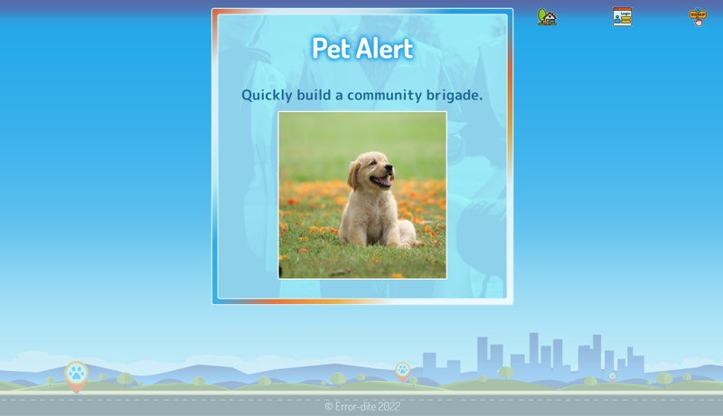

# Pet Alert
  
### An application by 
## EnshenZhu & somaiahuthappa & KennWg & H0RSESH0E  
&nbsp;    
 

 
 
 
 
 
 
 
 
 
 
 
 
 
 
 
 
 
  
&nbsp;  &nbsp;  
## Table of Contents
#### [Description](#description)  -  [Installation](#installation)  -  [Usage](#usage) - [License](#license) - [Contributing](#contributing) - [Questions](#questions)
&nbsp;  
## Description  
A MERN stack app that allows users to find their lost pets by creating reports that others can respond to and update.  It offers a user a dashboard where they can see all their posts, as well as those of other users of the site.  Allowing users to crowd source real-time from neighbors who have otherwise been strangers, the app helps families reunite and helps communities come together when there is a vital need quickly and efficiently.  
&nbsp;  
    
     
&nbsp;  
## Installation
Users simply need to navigate their web browsers to: http://aqueous-tor-23936.herokuapp.com  
&nbsp;  
## Usage
Please use the site responsibly.  
&nbsp;  
## License  

**MIT License**  
A short and simple permissive license with conditions only requiring preservation of copyright and license notices. Licensed works, modifications, and larger works may be distributed under different terms and without source code.  
[View the full license here.](./LICENSE/license.txt)  
&nbsp;  
## Contributing
Please contact any of the developers if you would like to participate in development of this application.  

&nbsp;  
## Questions
Please contact us through our GitHub acounts if you have any questions or concerns about the project.
&nbsp;  
&nbsp;  

  

